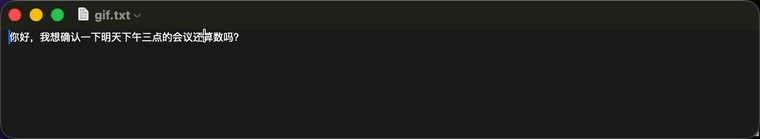
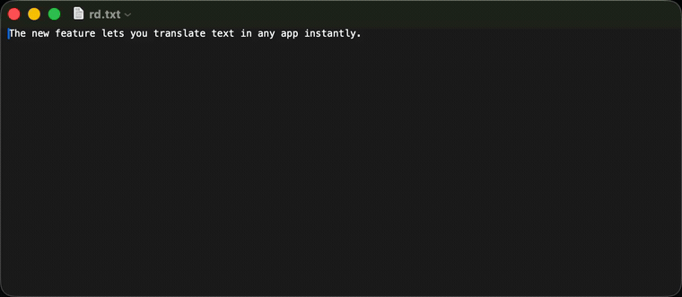
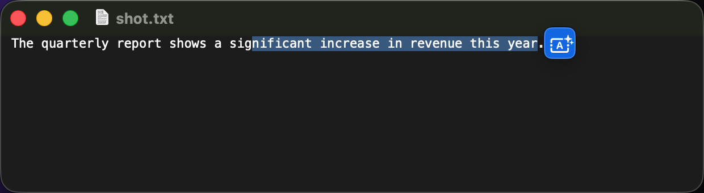

<h1 align="center">Translayr</h1>
<p align="center"><b>System-wide AI translation &amp; inline rewrite for macOS</b></p>

<p align="center">
  
  
  
  
  <a href="https://discord.com/invite/eGzEaP6TzR"></a>
</p>

<p align="center">
  <a href="https://everettjf.github.io/Translayr/">🌐 Website</a>
</p>

Translayr lives in your menu bar and works in **any** app. Two things, one shortcut each:

- **Read** — select foreign text, hit a shortcut, and a translation pops up next to it.
- **Write** — type in your own language, hit a shortcut, and it’s **rewritten in place** into the target language, ready to send.

Translation runs through a local model (**Ollama**) for full privacy, or any **OpenAI-compatible** endpoint for speed.

<p align="center">
  
  <br/><sub><i>Write · type in your language, press <kbd>⌥R</kbd>, and it’s rewritten in place.</i></sub>
</p>

<p align="center">
  
  <br/><sub><i>Read · select text and the translation streams into a popup — Copy or Replace.</i></sub>
</p>

<p align="center">
  
  <br/><sub><i>Optional floating icon appears right next to your selection.</i></sub>
</p>

---

## ✨ Features

- **Read · translate** — select text anywhere → popup with the translation. Trigger by shortcut, a floating icon next to the selection, or auto-translate on select.
- **Write · rewrite in place** — write in your native language, press the rewrite shortcut, and the input field is replaced with the translation. Replace immediately or preview first.
- **Works in every app** — uses the Accessibility API to read the selection, with a clipboard-copy fallback for Electron/web apps, so it works even where text APIs don’t. The original clipboard is always restored.
- **Undo-safe replacement** — replacements are pasted, preserving each app’s native undo stack.
- **Local or cloud** — pluggable backends: **Ollama** (offline, private) or any **OpenAI-compatible** API (`/chat/completions`, streaming). Switch in Settings.
- **Styles** — Faithful, Formal, Casual, or Polished, independently for read and rewrite.
- **Menu-bar only** — no Dock clutter. Global shortcuts, launch at login, per-app skip list.

## 🚀 Quick start

**1. Pick a backend**

Local (private, offline):
```bash
brew install ollama
ollama pull qwen2.5:3b   # or any chat model you like
ollama serve
```
…or cloud: in **Settings → Backend**, choose *OpenAI-compatible* and enter your base URL, API key, and model.

**2. Install Translayr**

Download the latest `.dmg` from [Releases](../../releases), drag it to Applications, and launch it.

**3. Grant Accessibility**

On first launch, allow Translayr under **System Settings → Privacy & Security → Accessibility** (required to read selections and replace text). Then:

- Select text → **⌥D** → see the translation.
- Type in your language → **⌥R** → it’s rewritten in place.

Shortcuts, triggers, styles, and languages are all configurable in **Settings**.

## ⌨️ Default shortcuts

| Action | Shortcut |
|---|---|
| Translate selection (read) | <kbd>⌥</kbd><kbd>D</kbd> |
| Rewrite & replace (write) | <kbd>⌥</kbd><kbd>R</kbd> |

## 🧠 How it works

```
Select / type  ─►  Shortcut · floating icon · auto
                          │
                 Capture (AX selection ─► clipboard fallback)
                          │
              Translate (Ollama / OpenAI-compatible, streaming)
                          │
        Read: popup  ·  Write: paste in place (undo-safe)
```

## 🏗️ Project structure

```
Translayr/
├── Core/          # SelectionCapture, TextReplacer, TriggerController,
│                  # SelectionMonitor, PopupPositioner, LaunchAtLogin, …
├── Translation/   # TranslationProvider, Ollama / OpenAI providers,
│                  # TranslationService, cache, model resolver
├── UI/            # Translation popup + floating selection icon
├── Config/        # AppSettings, LanguageConfig
├── Services/      # GlobalShortcutCenter, UpdateChecker, system service
└── Views/         # Menu bar + Settings
```

## 🔨 Build & release

```bash
open Translayr.xcodeproj        # ⌘R to run

# Signed release + notarized DMG (configure .env from .env.template first)
./scripts/build-release.sh      # → build/Translayr.dmg
```

Requirements: macOS 13+, Xcode 15+. The app is **not** sandboxed (it needs Accessibility + synthetic key events). For local dev builds, sign with your Apple Development team so the Accessibility grant persists across rebuilds.

## 🔧 Troubleshooting

- **Shortcut does nothing** → confirm Accessibility is granted (Settings → General shows *Granted*) and Translayr is enabled in the menu bar.
- **No translation** → Ollama: is `ollama serve` running and the model installed? (Translayr auto-picks an installed model if your configured one is missing.) OpenAI: check base URL / key / model.
- **Misaligned popup in some apps** → those apps don’t expose text bounds; the popup falls back to the cursor position.

## 🤝 Contributing

Issues and PRs welcome. Join the [Discord](https://discord.com/invite/eGzEaP6TzR).

## 📄 License

[MIT](LICENSE) · Made with ❤️ for macOS. If Translayr helps you, a ⭐️ is appreciated!
