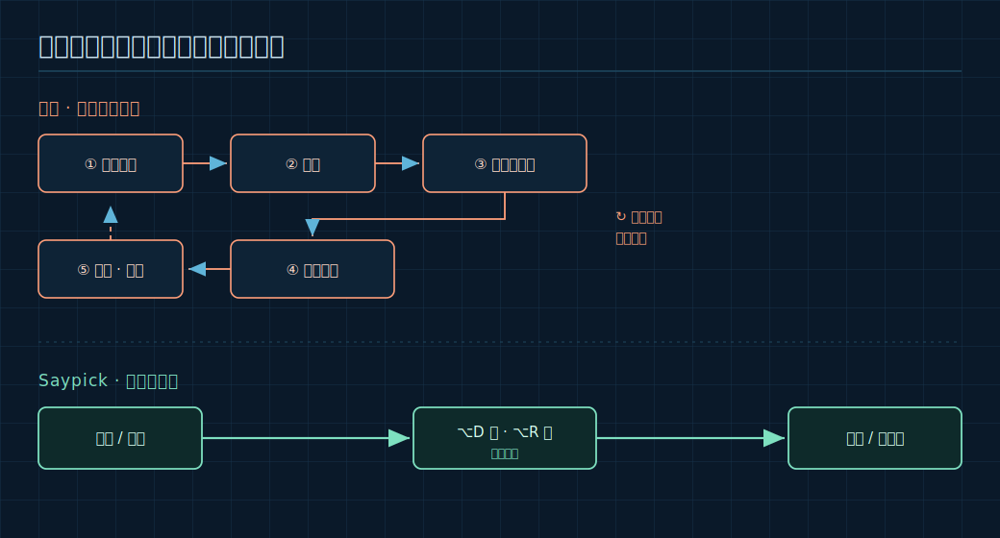
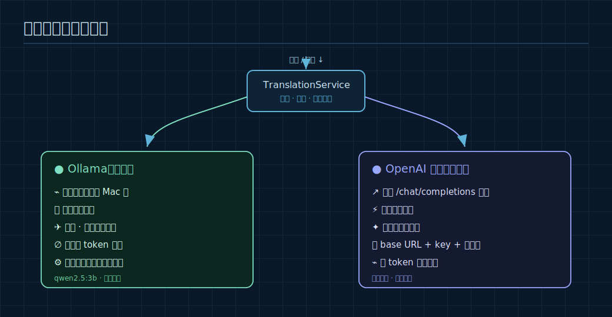
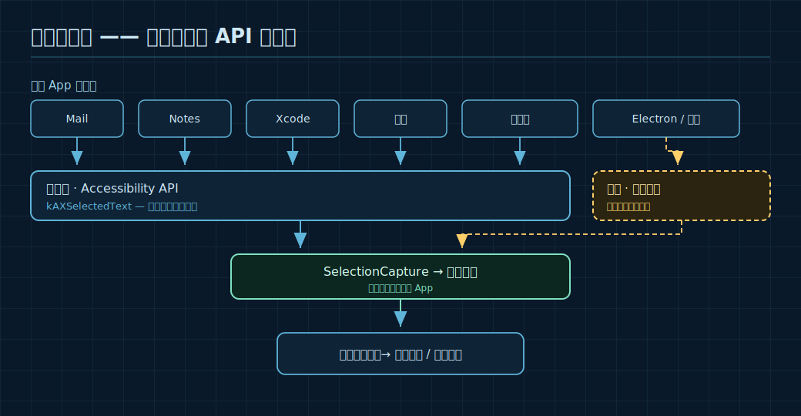
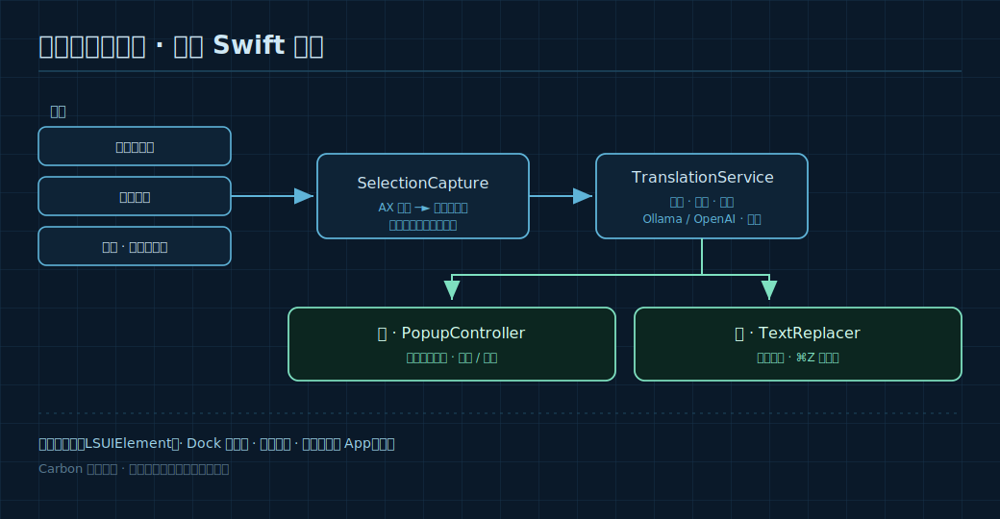

# Saypick：把翻译变成一个系统快捷键

> 选中外文，一个快捷键读懂它；用母语打字，一个快捷键把它就地改写成另一种语言。无论在 **哪个 App**，都能用，而且模型可以完全跑在你自己的 Mac 上。

如果你每天都在多种语言之间切换——读一条英文的 Slack、用西班牙语回客户、扫一眼俄文文档——你一定熟悉那种"翻译税"：

把文字从当前 App 里复制出来 → 粘贴到翻译网页 → 复制结果 → 切回去 → 再粘贴。**每一句话，都是一次上下文切换。**



**Saypick** 想做的，就是把这个循环删掉。它是一个很小的 macOS 菜单栏 App，只做两件事，每件事都藏在一个全局快捷键背后，在你系统的任何地方都能触发。

---

## 一、两个动词：读（Read）与写（Write）

### 读 —— 看懂任何你选中的文字

在任意 App 里选中文字，按下 <kbd>⌥</kbd><kbd>D</kbd>，一个浮窗就会贴着你的选区把译文 **流式** 地显示出来。你可以 **复制** 它，也可以直接 **就地替换** 原文。

不想碰键盘？打开选区旁边的浮动小图标，或者干脆开 **自动翻译**——你一选中，浮窗就出现。


这是最日常的场景：代码注释里的一个生词、PDF 里的一段话、一条聊天消息——不离开当前 App 就读懂它。

### 写 —— 用另一种语言就地回复

这是大多数翻译工具忽略的部分。用你的 **母语** 打字，按下 <kbd>⌥</kbd><kbd>R</kbd>，输入框里的文字就会 **就地被改写** 成目标语言——直接可发。没有浮窗要去复制，没有来回搬运。


Saypick 用"粘贴"的方式写回结果，所以 App 原生的 **撤销** 依然有效——一次 <kbd>⌘</kbd><kbd>Z</kbd> 就能把原文找回来。想发之前先看一眼？在设置里打开改写 **预览**，确认后再发。

---

## 二、本地优先，或自带模型

Saypick 对后端不挑食，内置两种可插拔的 provider：

- **Ollama（本地）** —— 在自己机器上跑 `qwen2.5:3b` 这样的模型。数据不出本机，在飞机上也能用，也没有按 token 计费。如果你配置的模型没装，Saypick 会自动挑一个已装的。
- **OpenAI 兼容（云端）** —— 指向任意 `/chat/completions` 接口，填好 base URL、key 和模型名即可。想要极致速度或前沿模型时很合适。

两者都是 **逐 token 流式** 输出，所以译文是边生成边出现的。



---

## 三、哪里都能用——连没有文本 API 的地方也行

大多数"划词翻译"工具，一旦离开原生文本框就失灵。Saypick 通过 macOS 的 **辅助功能（Accessibility）API** 读取你的选区；当某个 App 不暴露文字时（说的就是你，Electron 和网页应用），它会退回到"合成复制"——而且 **事后总会还原你原来的剪贴板**。

结果就是：Mail、Notes、Xcode、终端、浏览器、Electron 聊天 App……它都能用。



---

## 四、四种语气风格

翻译不是一刀切的。Saypick 提供四种风格，读和写可以分别设置：

| 风格 | 适合场景 |
|---|---|
| **忠实（Faithful）** | 朴素、准确的直译 |
| **正式（Formal）** | 工作邮件的专业语气 |
| **随意（Casual）** | 聊天里自然口语化的表达 |
| **润色（Polished）** | 在保留原意的前提下，让它读起来像母语者写的 |

支持检测与翻译的，是全球使用人数最多的十种语言：英语、中文、印地语、西班牙语、法语、阿拉伯语、孟加拉语、俄语、葡萄牙语、印尼语。设置一次母语和目标语言，读的方向会自动检测。

---

## 五、它是怎么工作的



底层是一个专注的原生 Swift App：一层架在辅助功能 API 上的 `SelectionCapture`，一个带缓存和风格注入、能路由到两种 provider 的 `TranslationService`，以及一个可撤销的 `TextReplacer`。它是纯菜单栏应用（`LSUIElement`），所以 Dock 里没有图标——只有全局快捷键、开机自启，以及一个"跳过 App"名单，让你在不想用它的应用里关掉它。

---

## 六、三步上手

1. **选后端。** 想要私密 / 离线：
   ```bash
   brew install ollama
   ollama pull qwen2.5:3b
   ollama serve
   ```
   ……或在 **设置 → 后端** 选 *OpenAI 兼容*，粘贴你的 base URL、key 和模型名。
2. **安装。** 从 [Releases](https://github.com/everettjf/Saypick/releases) 下载最新的 `.dmg`，拖进 Applications。
3. **授予辅助功能权限。** 在 **系统设置 → 隐私与安全性 → 辅助功能** 里允许 Saypick（这是它能读取选区、替换文字的前提）。然后：选中文字 → <kbd>⌥</kbd><kbd>D</kbd>，或打字 → <kbd>⌥</kbd><kbd>R</kbd>。

快捷键、触发方式、风格、语言——全都可以在设置里调。

---

## 七、为什么我要做它

我想让翻译感觉像一个 **系统功能**，而不是一个要去的"目的地"。不用开新标签页，不用复制粘贴来回倒腾，而且——当我离线、或处理一些隐私内容时——没有任何数据离开我的笔记本。Saypick 就是这个：一个安静待在菜单栏里的小助手，把"去翻译一下这个"变成一次按键。

它是 **开源的（MIT）**。如果它每天能帮你省下几次上下文切换，欢迎去 [GitHub](https://github.com/everettjf/Saypick) 点个 ⭐️，也欢迎来 [Discord](https://discord.com/invite/eGzEaP6TzR) 聊聊问题和想法。

---

*Saypick · 面向 macOS 26+ 的系统级 AI 翻译与就地改写。[官网](https://everettjf.github.io/Saypick/) · [GitHub](https://github.com/everettjf/Saypick) · [English version](introducing-saypick.md)*
